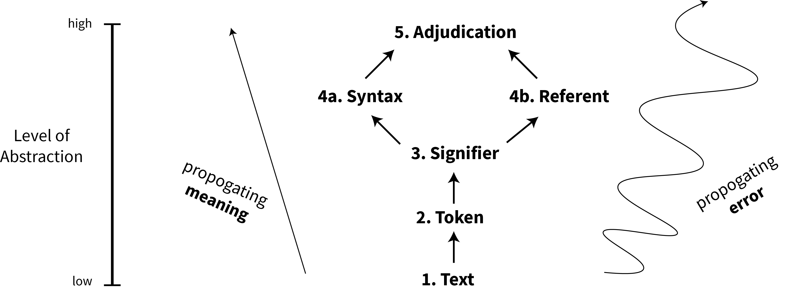

# Machine-assisted dossiers

Preliminary notes on a "dossier" tool to help journalists and researchers collect, manage, and explore uncertain information about organizations. In the complete version, the tool would have

* individual pages for people and organizations
* dedupe.io integration, to automatically suggest connections among entities for user review
* ability for the user to edit info about the entities
* ability for the user to add relations between people and organizations manually
* ability for the user to maintain notes on sources and claims
* permissioning systems for all of that.

I know this is the type of tool you've though of for a while. It would be great if we could find a time to chat to hear your thoughts and see if we can perhaps pool some resources.

## Prior Art
### Various works by Pudo
- http://pudo.org/blog/2014/03/30/grano.html
- http://untangled.knightlab.com/readings/charting-social-network-analysis-tools.html
- https://github.com/alephdata

### Family Search

The Church of the Latter Day Saints' geneological tool.

- https://familysearch.org/

### Opencorporates

An open database of companies, focused on determining subsidiary and branch relationships.

- https://blog.opencorporates.com/2014/01/08/understanding-corporate-networks-part-4-how-we-record-the-data/

# Sketch

One of the biggest challenges to developing dossiers is **managing and archiving inferences**. At every level of data collection – from text extraction, to entity resolution, to drawing org charts – there are different kinds of claims that are made about the relationship between sources (data) and entities (the world). Our goal is to develop a consistent language to describe these different kinds of inferences, and use that language to construct a data model that would allow the users of a dossier tool to efficiently collect and audit these claims. 

We believe that the work of collecting information about an entity can be roughly organized into **five levels of inference**. At each level, we want to collect metadata about:

- Who or what made the inference
- When and where the inference was made
- What reasoning process produced the inference (be it human- or machine-driven)

### 1. Text: *Collecting source artifacts*

Every claim about the world starts with a source artifact, or *Text*, that contains information that humans can interpret as language. For us, Texts are most often different types of files: word processing documents, PDFs, markup, spreadsheets, etc. If we were building a dossier about security forces, for example, Texts might be audio testimony from witnesses and victims, news articles about security force activity, or scanned government documents.

At the level of *Text*, the processes that can produce inference include:

- Human collection
- Web scraping
- FOIA requests
- Bulk downloads

### 2. Tokens: *Extracting units of meaning from Text*

Assuming that we are working with physical artifacts that we believe to be representations of language, our next step is to interpret these artifacts as a sequence of *Tokens*, the most basic unit of meaning in a Text. If the source artificact is, say, a "Microsoft Office File", this level of "inference" may just mean converting to some more convenient format. If the source artifact is a scanned page, then this interpetation might be done by OCR or a human transcriber. Similar for audio.

We draw the concept of "tokens" from analytic philosophy. More on tokens at [the Stanford Encyclopedia of Philosophy](https://plato.stanford.edu/entries/types-tokens/#DisBetTypTok).

At the level of *Tokens*, the processes that can produce inference include:

- File format conversion
- OCR
- Human transcription

###  3. Signifiers: *Deciding which Tokens are references to entities and attributes*

On their own, Tokens encode claims about what language is present in a Text, but not about what sorts of things in the world that the Text might be describing. We must make inferences about Tokens to produce *Signifiers* – references to abstract types of entities and attributes contained in a Token.

If we have a spreadsheet, this might mean interpreting that a column called "recipient" contains references to persons who received something, or deciding that "John Smith" refers to a member of the class "Security force lieutenant." If we have less structured text, this might involve the tasks of "[Named Entity Recognition](https://en.wikipedia.org/wiki/Named-entity_recognition)" and [Coreference resolution](https://nlp.stanford.edu/projects/coref.shtml).

Notice that at this step we are not deciding that a particular Token refers to particular entity, but rather that a Token refers to **some abstract type of entity within a class**. The decision to assign a Signifier to a particular entity in the world corresponds to unit 4b, the "entity resolution" unit – a higher level of abstraction.

At the level of *Signifiers*, the processes that can produce inference include:

- Named entity recognition
- Coreference resolution
- Human judgment

### 4a. Syntax: *Interpreting abstract claims about Signifiers*

*This unit happens at the same level of abstraction as unit 4b, but we believe it to be a distinct form of inference.*

Syntax defines relationships between Signifiers.

For example, suppose we have a spreadsheet that has columns labeled "donor", "recipient", and "amount". We might interpret a row of data as making the following claims:

1. There exists some entity designated by the token in the "donor" field (Signifier)
2. There exists some entity designated by the token in the "recipient" field (Signifier)
3. The entity designated by the token in the "recipient" field recieved an amount of money designed by the "amount" field from the entity designated by the token in the "donor" field (Syntax)

By making a claim of the Syntax type in inference #3, we map a relationship between three distinct entities that we infer to exist from the Text: "recipient" gives "amount" of money to "donor."

At the level of *Syntax*, the processes that can produce inference include:

- Human judgment
- (NLP processes?)

### 4b. Referents: *Resolving entities among Signifiers* 

*This unit happens at the same level of abstraction as unit 4a, but we believe it to be a distinct form of inference.*

By defining a Signifier, we've linked Tokens to abstract classes of entities, but we haven't actually posited that the Signifier is referential to a *particular* entity in the real world. Defining a Referent involves making that conceptual link, such that we can connect the Signifiers and Syntax we've inferred (such as "John Smith is a security force lieutenant") to concrete entities in the real world (such as "*This particular* John Smith, *who we believe was involved in a militia incident in Kinshasa in May 2017*, is a security force lieutenant").

At the level of *Referents*, the processes that can produce inference include:

- Dedupe.io entity resolution
- Human judgment

### 5. Adjudication: *Accepting or rejecting abstract claims (Syntax) about entities (Referents)*

Upon deciding which Signifiers are about the same entity (Referent), and what Syntax relates those Referents, we resolve the abstract claims to specific claims about entities. But claims can sometimes conflict, so we have to choose which claims to adopt and reject, and store our reasoning about which claim is most likely and why.

At the level of *Adjudication*, the processes that can produce inference include:

- Logical syntax ("A security force can have at most one commander at a moment in time")
- Belief pooling
- Human judgment

### Levels of abstraction

Notice that these levels of inference are **cumulative and hierarchical**, corresponding to a ladder of abstraction. Each level of inference builds on the previous levels, indicating that both *meaning* and *error* propogate as we move up into higher levels of abstraction.

### Data Model
Informing all of this is a data model. This is more or less formal model of the portion of the world that the researcher cares about and her belief about how those portions are related. For example, for security force monitoring, we believe and care to believe that security forces are organizations composoed of sub organizations; these oranizations and suborganizations have names, that they have commanding officers; etc. We believe that those commanding officers are people, and that these people have names, and birthdates, and previous posts. We may also believe that they have favorite colors, but probably won't include that in our model.

The data model determines 

- universe of material we will collect
- what classes of signifiers we care about extracting
- what types of claims we will bother making interpretations about
- what type of claims can be condordant or discordant

